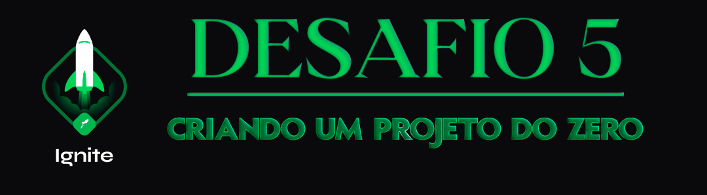

<div align="center">
  
</div>

<h1 align="center"> RocketSeat 🚀 Ignite ReactJS 🔥</h1>

<p align="center">
  <a href="https://rocketseat.com.br">
    
  </a>
  
  
  
</p>

## 🧠 Detalhes do desafio

Nesse desafio, você deverá criar uma aplicação para treinar o que aprendeu até agora no ReactJS

Essa será uma aplicação onde o seu principal objetivo é criar um blog do zero. Você vai receber uma aplicação praticamente em branco que deve consumir os dados do Prismic e ter a interface implementada conforme o layout do Figma. Você terá acesso a diversos arquivos para implementar:

- [x] Estilizações global, comum e individuais;
- [x] Importação de fontes Google;
- [x] Paginação de posts;
- [x] Cálculo de tempo estimado de leitura do post;
- [x] Geração de páginas estáticas com os métodos `getStaticProps` e `getStaticPaths`;
- [x] Formatação de datas com `date-fns`;
- [x] Uso de ícones com `react-icons`;
- [x] Requisições HTTP com `fetch`;

## ⚙️ Instalação do projeto

## Clone este repositório e acesse o diretório

```sh
$ git clone git@github.com:augustohermes/desafio-05-criando-uma-aplicacao-do-zero.git && cd desafio-05-criando-uma-aplicacao-do-zero
```

## Instale as dependências necessárias

```sh
$ yarn
```

## Adicione suas variáveis de ambiente no arquivo **.env.example** e renomeie o arquivo para **.env.local**
As variáveis devem ser preenchidas da seguinte forma:

```bash
# Prismic
PRISMIC_ACCESS_TOKEN=Variavel obtida no campo API Endpoint
PRISMIC_API_ENDPOINT=Variavel obtida no campo Permanent access tokens em Access to master
PRISMIC_DOCUMENT_TYPE=nome do documento repetível, exemplo: "posts"
```

## Rodando o projeto

Após o correto preenchimento do .env.local execute o seguinte comando para rodar a aplicação:

```sh
$ yarn dev
```

<br>

Feito com ❤️ por [Augusto Hermes](https://github.com/augustohermes) 👋.
